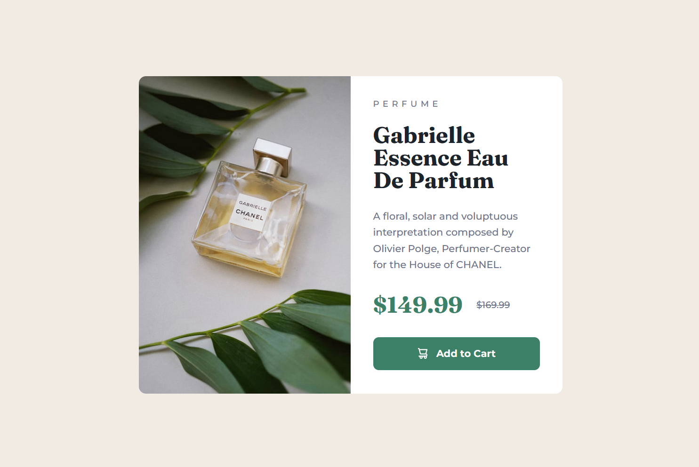
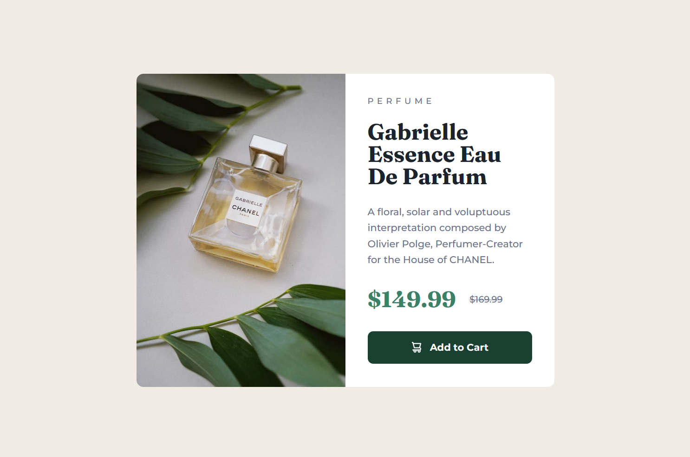

# Frontend Mentor - Product preview card component solution

This is a solution to the [Product preview card component challenge on Frontend Mentor](https://www.frontendmentor.io/challenges/product-preview-card-component-GO7UmttRfa). Frontend Mentor challenges help you improve your coding skills by building realistic projects.

## Table of contents

- [Overview](#overview)
  - [The challenge](#the-challenge)
  - [Screenshot](#screenshot)
  - [Links](#links)
- [My process](#my-process)
  - [Built with](#built-with)
  - [What I learned](#what-i-learned)
- [Author](#author)

**Note: Delete this note and update the table of contents based on what sections you keep.**

## Overview

### The challenge

Users should be able to:

- View the optimal layout depending on their device's screen size
- See hover and focus states for interactive elements

### Screenshot

### Links

- Solution URL: [Frontend Mentor Solution](https://www.frontendmentor.io/solutions/responsive-product-preview-card-component-KWGSZ4SNW0)
- Live Site URL: [Live Site](https://nelson-j-montesinos.github.io/Product-Preview-Card/)

## My process

### Built with

- Semantic HTML5 markup
- CSS custom properties
- Flexbox
- Mobile-first workflow

### What I learned

Throughout this project, I had the opportunity to strengthen and apply my existing skills, rather than acquire new ones.

## Author

- Frontend Mentor - [@Daydream-Softworks](https://www.frontendmentor.io/profile/Daydream-Softworks)
- LinkedIn - [@NelsonMontesinos](www.linkedin.com/in/njmontesinos)
